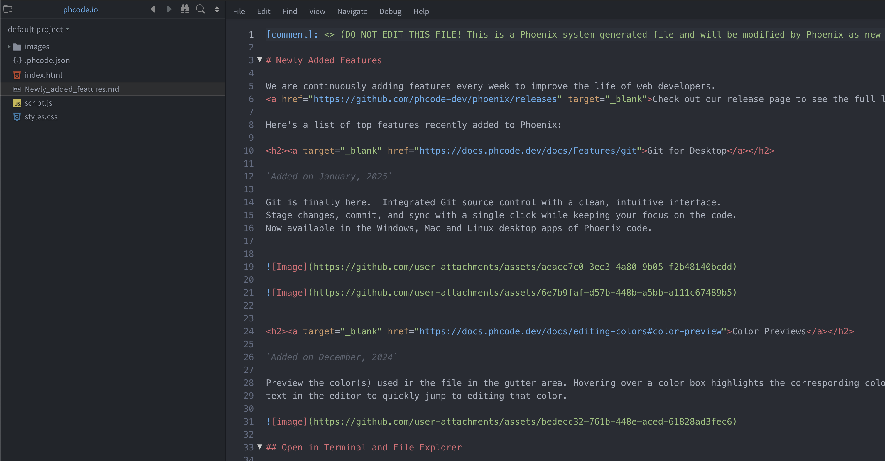

# One Dark Rise Theme

A refined dark theme for Phoenix Code based on Atom's One Dark, developed by RiseIndustries. This theme provides both syntax highlighting and UI theming for a complete dark coding experience.

## Features

- Complete implementation of Atom's One Dark color scheme
- Enhanced UI elements with carefully selected dark tones
- Vibrant syntax highlighting for improved code readability
- Optimized contrast ratios for comfortable extended coding sessions

## Installation

1. Open phCode
2. Go to Themes (View > Themes > Get more > Search)
3. Search for "One Dark Rise Theme"
4. Click Install

## Activation

1. Go to View > Themes
2. Select "One Dark Rise Theme" from the list
3. The theme will be applied immediately

## Compatibility Notes

While we've strived for maximum similarity with the original Atom One Dark theme, some elements in phCode are handled differently. Certain UI components cannot be fully themed without source code modifications, resulting in minor visual differences compared to the original Atom One Dark theme.

## Contributing

We welcome contributions to improve this theme! Please feel free to submit issues or pull requests to our [GitHub repository](https://github.com/riseindustries/phcode-one-dark-rise-theme).

## About Rise Industries

RiseIndustries develops premium themes and tools for various development environments. Check out our other projects at [our GitHub profile](https://github.com/riseindustries).

## License

This theme is released under the MIT License. See the LICENSE file for details.

## Acknowledgments

- The original Atom One Dark theme developers
- The phCode development team
